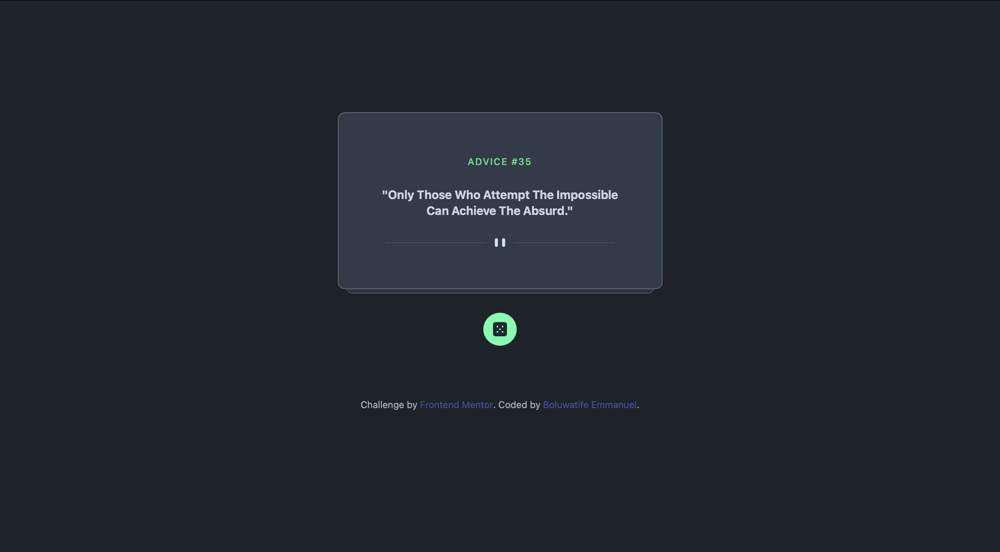

# Frontend Mentor - Advice generator app

This is a solution to the [Advice generator app challenge on Frontend Mentor](https://www.frontendmentor.io/challenges/advice-generator-app-QdUG-13db). Frontend Mentor challenges help you improve your coding skills by building realistic projects.

## Table of contents

- [Overview](#overview)
  - [The challenge](#the-challenge)
  - [Screenshot](#screenshot)
  - [Links](#links)
- [My process](#my-process)
  - [Built with](#built-with)
  - [What I learned](#what-i-learned)
  - [Continued development](#continued-development)
- [Author](#author)
- [Acknowledgments](#acknowledgments)

## OverView

This project is an advice generator app that uses the [Advice Slip API](https://api.adviceslip.com). The app generates a piece of advice when the user clicks on the dice icon. The design is responsive and provides an optimal layout for any device's screen size.

## The challenge

The challenge is to build out this advice generator app using the [Advice Slip API](https://api.adviceslip.com) and get it looking as close to the design as possible.

Your users should be able to:

- View the optimal layout for the app depending on their device's screen size
- See hover states for all interactive elements on the page
- Generate a new piece of advice by clicking the dice icon

## Screenshot

### Links

- Live Site URL: [advice-quote-generator](https://bolexzy.github.io/advice-quote-generator/)

## My process

### Planning

Before writing any code, I started by planning the structure of the project. I decided to use a modular approach, separating the JavaScript, CSS, and HTML files for better organization and readability.

### Design

For the design, I wanted to keep it simple and clean. I used a minimal color palette and focused on creating a user-friendly interface. I used CSS Flexbox for the layout to ensure the design was responsive and would look good on any device.

### Development

I used HTML5 for the markup, CSS for styling, and JavaScript for the functionality. I used the Fetch API to retrieve data from the Advice Slip API and dynamically update the DOM.

### Challenges

One of the main challenges I faced was handling errors from the API. I learned how to use `try/catch` blocks to handle these errors and provide a fallback in case the API request failed.

### Reflection

This project was a great learning experience. It helped me improve my problem-solving skills and deepen my understanding of JavaScript and API interaction.

## Built with

- Semantic HTML5 markup
- CSS custom properties
- Flexbox
- Mobile-first workflow
- [React](https://reactjs.org/) - JS library
- [Next.js](https://nextjs.org/) - React framework
- [Daisy UI](https://daisyui.com.com/) - For styles

## What I learned

Through this project, I learned how to use the Fetch API to retrieve data from an external API and dynamically update the DOM.

## Continued development

In the future, I plan to add more features to this app, such as the ability to save favorite pieces of advice and share them on social media.

## Author

- Website - [Boluwatife Emmanuel](https://boluwatife-linktree.vercel.app)
- Twitter - [@Bolexzyy__](https://www.twitter.com/Bolexzyy__)

## Acknowledgments

I would like to thank frontend mentor and the online developer community for their help and support in completing this project.
